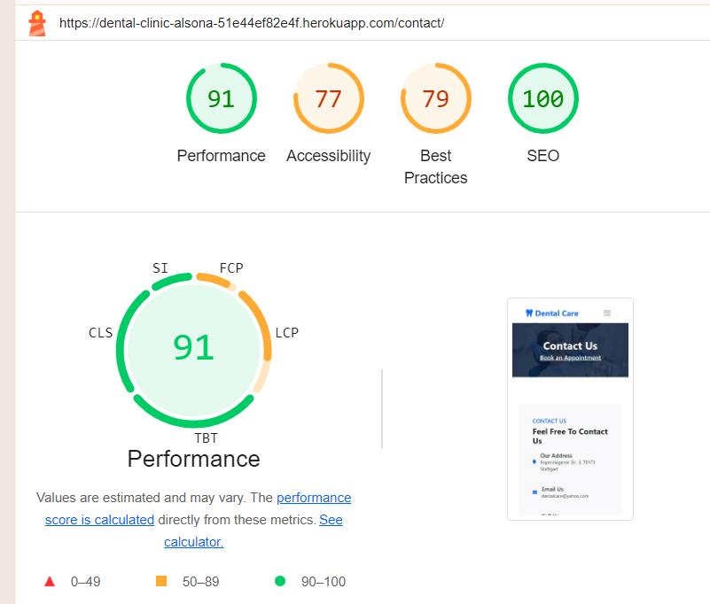
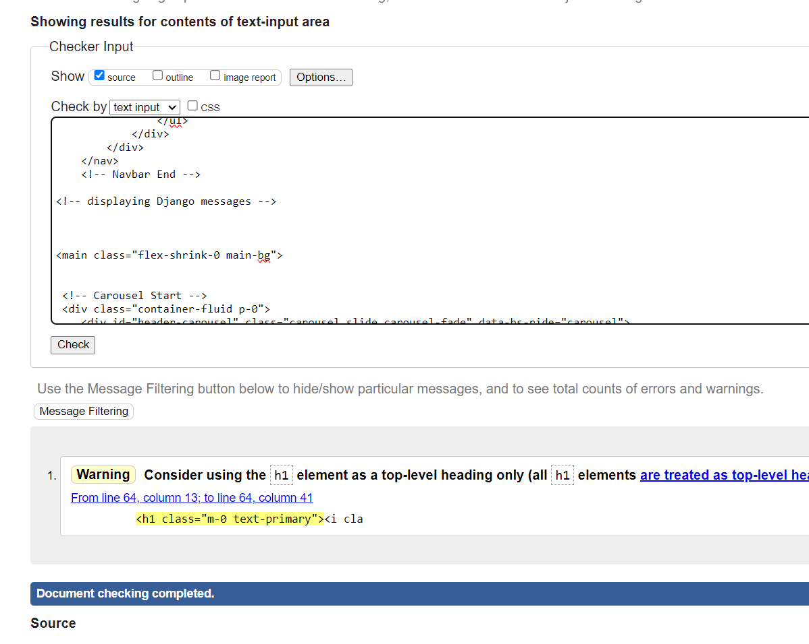
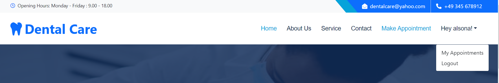
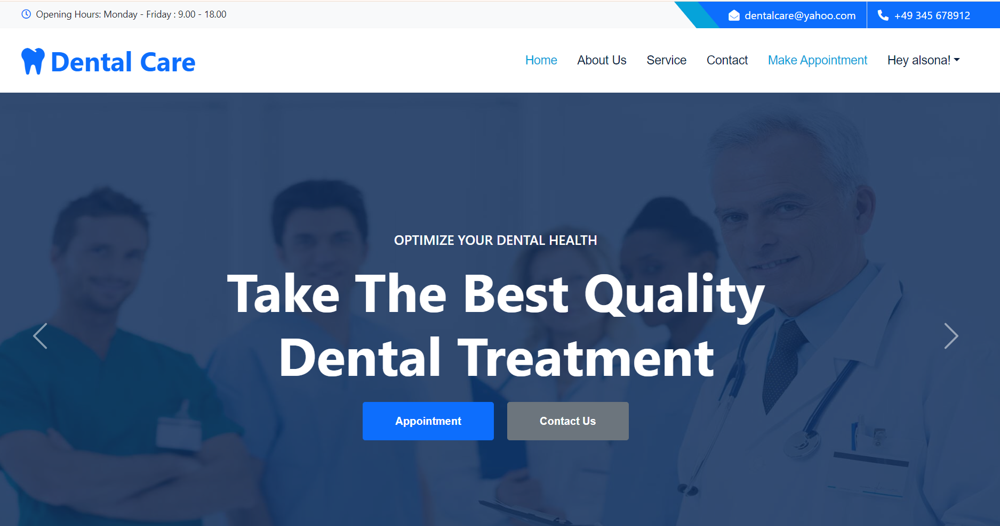
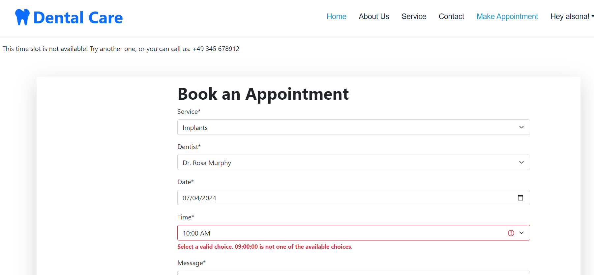

# 
Dental Care

### [Live site](https://dental-clinic-alsona-51e44ef82e4f.herokuapp.com/)

## Contents:

- <a href="#ux">UX</a>
  - <a href="#strategy">Strategy</a>
  - <a href="#db">Database structure</a>
  - <a href="#design">Design</a>
  - <a href="#wireframes">Wireframes</a>
- <a href="#testing">Testing</a>
- <a href="#bugs">Bugs</a>
- <a href="#features">Existing Features</a>
- <a href="#f_features">Features left to Implement</a>
- <a href="#technology">Languages, Technologies & Libraries</a>
- <a href="#credits">Credits</a>
- <a href="#deployment">Deployment</a>
- <a href="#acknowledgements">Acknowledgements</a>

## 
UX

### Overview
Dental Care is a comprehensive website designed for anyone seeking a variety of dental services. Our clinic offers a wide range of treatments, including teeth whitening, orthodontics, implants, and fillers. Our experienced team includes three distinguished dentists: prosthodontists Felix Ellis and Paul Kefalas, and orthodontist Rosa Murphy. Patients can easily book appointments with the dentist of their choice.

In addition, the website features a convenient contact form for any questions or concerns you may have. Patients can also create an account to view their appointment history and manage upcoming appointments. Our goal is to make dental care as accessible and convenient as possible for everyone.

#### First Time User
- The user can contact the clinic for any question they might have.
- A user who is looking for clear information about the Dental Care clinic and services provided.
- A user who prefers to make bookings digitally rather than speaking with others.
- An overall information about the clinic. 

#### Returning User
- As a returning user, I would like to review all my previous dentist's appointments.
- As a returning user, who already has an account I would like quickly and easily make an appointment with a particular dentist.
- As a returning user, I would like to see updates to the information on the site, for example new prices or new services. 

### 
Strategy

To determine the best approach, we focused on understanding the needs of our potential users. This involved ensuring they could log in, and quickly and easily perform all necessary actions, including booking, reading, updating, and deleting appointments (CRUD).

One of the standout features of our website is the ability to book appointments based on real-time availability with specific dentists. The booking form includes three dependent dropdown lists, allowing users to select the service they need, choose their preferred dentist, and pick a suitable date and time for their appointment.

#### Agile
The Agile methodology was used to plan the project. Github was used as the tool to demonstrate this. Milestones were used to create Epics. Each user story was linked to an Epic and placed within one of three Iterations. Issues were used to create User Stories with custom templates ([Link to Kanban board](https://github.com/users/alsona1188/projects/10/views/1)). 
To prioritize tasks [MoSCoW method](https://github.com/alsona1188/pp4-dental-clinic/issues?q=is%3Aissue+is%3Aclosed) was used.

#### User Stories 

Issues were used to create User Stories with custom templates for admin and user. I added the acceptance criteria and the tasks so I can track my work effectively. Once I completed a User Story I would move it from `in progress` to `completed`. 

- Completed User Stories: 

  - Epic: Enable users to CRUD the bookings. 

    - As a site user I can book an appointment so that I can have the service I want.
    - As a site user I can update my appointment so that I can change the details.
    - As a site user I can view my appointments so that I can keep track of them.
    - As a logged-in user I can to view my profile information so that I can see my appointment history.
    - As a site user I can click on the delete button so that cancel my appointment.

  - Epic: Enable users to create an account and log in.  

    - As a user I can log in so that I can access my profile.
    - As a site user I can create an account so that I can be able to interact with the website.  

  - Epic: Enable unregistered users to view all the key information about the dental clinic.  

    - As a site user I can examine the information on the home page about the services provided so that I can decide if i want to use them.
    - As a site user I can click on the about page so that I can read all the information.  

  - Epic: Set up service and contact page.  
    - As a site user I can click on the contact page so that I can read all the contact forms.
    - As a site user I can click on the service page so that I can read all the info about the services that are
offered.  

  - Epic: Epic: Set up admin page for admin to manage the dental clinic.  
    - As an admin I can have a CRUD access to database data so that I can make necessary changes.
    - As an admin I can view the appointments so that I can manage the doctor's timetable.
    - As an admin user I can update the about page so that it is updated and available for the users.  

- Uncompleted User Stories:  

    The following User Stories were not completed (marked as `wont have` in MoSCoW method table) as they were deemed to be not necessary for this project at this time but are indications of possible future features:  

    - As a site user I can receive the confirmation email so that I can see my appointment.
    - As a site user I can edit my password so that change my profile data.
    - As a site user I can be able to click on the blog page so that I can see the content.

  ---

### 
Database structure

When I decided on my initial concept of this project I knew I needed to understand what type of data I would need to store and the relationships between them. I created a Database Schema to help guide me.

#### Relationships

- A Service can be provided by multiple Dentists, and a Dentist can offer multiple Services. (Many-to-Many)
- An AppointmentRequest is associated with a User, a Service, and a Dentist. (Many-to-One for each relation)
- An AvailableTimeSlot is associated with a Dentist. (Many-to-One)
- User model (from Django's auth system) is associated with AppointmentRequest.

#### Models and Fields
- Service
  - name: CharField
  - price: DecimalField
  - featured_image: CloudinaryField
  - description: TextField

- Dentist
  - first_name: CharField
  - last_name: CharField
  - specialty: CharField
  - services: ManyToManyField (related to Service)
  - featured_image: CloudinaryField

- ContactFormRequest
  - name: CharField
  - email: EmailField
  - subject: CharField
  - message: TextField
  - read: BooleanField

- About
  - title: CharField
  - updated_on: DateTimeField
  - content: TextField
  - featured_image: CloudinaryField

- AppointmentRequest
  - user: ForeignKey (related to User)
  - service: ForeignKey (related to Service)
  - dentist: ForeignKey (related to Dentist)
  - date: DateField
  - time: TimeField
  - message: TextField
  - read: BooleanField
  - created_at: DateTimeField

- AvailableTimeSlot
  - dentist: ForeignKey (related to Dentist)
  - date: DateField
  - time: TimeField

### 
Design

The site design is intuitive and functional. The main goal of the site is to provide users with practical and useful information about the services and functionality for making an appointment, and in this context, purposeful efforts have been made, as well as focus on the views required by users.
The colours are chosen to convey the dental environment. They are specified on the style.css: 
  - :root {
    --primary: #06A3DA;
    --secondary: #F57E57;
    --light: #EEF9FF;
    --dark: #091E3E;
}

### 
Wireframes
 

> home.html

> about.html

> contact.html

> appointment.html

> appointment_list.html

<a href="#up">Back to Top of page</a>

---
## 
Testing

### Manual testing
Thorough testing was conducted by the developer and multiple users among friends and family. Usability suggestions were considered and acted on.
All design features have been manually tested and everything functions as expected. Testing was completed in my local terminal and also in Heroku deployment.

- Testing for responsiveness was conducted using Chrome Dev Tools. The website was tested extensively on a range of emulated mobile, tablet and large format screen sizes in both portrait and landscape orientations.<a href="#responsiveness">(Testing results are here)</a>

- All HTML files were passed through the W3C validator with no errors.
- CSS file (`style.css`) was passed through the W3C validator with no errors.
- The website was tested on browsers Chrome, Firefox, Edge and Opera.
- All user flows were tested, including landing page navigation, link clicks and forms submissions.
- All forms have been tested to ensure they are validated and can be submitted without errors.

The steps and results are as follows.

### 
Testing User Stories 

| User story        | User story testing |           
| ------------------ | ------------- | 
|  As a site user I can book an appointment so that I can have the service I want. | The logged in user can make an appointment by clicking on "make appointment" and a form will appear where the user can choose the dentist, the service and the time that he wants. | 
| As a site user I can update my appointment so that I can change the details. | The logged in user can see the appointments that he booked and can change the date, the time, the service or even the dentist that he wants. A confirmation message will appear as well. The user can click the "Edit" button for each of their appointments and is redirected to the `update` page. On the `update` page they can see all the details of the current booking and below the form for making changes. After making the necessary changes, the user can click `Change` button and is redirected to the "my appointments" page, where all changes are reflected. Or the user can click the `Cancel` button to be redirected to the profile page without making any changes. | 
| As a site user I can view my appointments so that I can keep track of them. | The logged in user can see the appointments that he booked after he clicks on the my appointments. | 
| As a logged-in user I can to view my profile information so that I can see my appointment history. | A list of all the appointments will appear after the user is logged in and clicks on the my appointments. | 
| As a site user I can click on the delete button so that cancel my appointment. | The logged in user can see the appointments that he booked and can delete the appointment that he doesn't want anymore. A confirmation message will appear as well. The user can click the `Delete` button for each of their appointments and is redirected to the `delete` page. On the `delete`  page they are asked to confirm the deletion. If they click "Yes" button, the appointment is deleted, and they are redirected to the "my appointments" page. If they click `Cancel` button, they are redirected to the profile page without deleting the appointment. | 
| As a site user I can create an account so that I can be able to interact with the website. | The user can sign up and create an account so that he can be able to book an appointment. 
| As a user I can log in so that I can access my profile. | Once logged in, a registered user can view a list of their appointments. If the user does not have an appointment yet, a message will appear that there is no appointment yet. | 
| As a site user I can examine the information on the home page about the services provided so that I can decide if i want to use them. | AS a user that is not registered yet and enters into the website for the first time, he is still able to get all the necessary information about the services, the dentists and the location. |
| As a site user I can click on the about page so that I can read all the information. | As a registered or unregistered user, you can still read all the information on the about page. |
| As a site user I can click on the contact page so that I can read all the contact forms. | As a registered or unregistered user, you can still read all the information on the contact page and also be able to contact the dental clinic through the contact form. |
| As a site user I can click on the service page so that I can read all the info about the services that are offered. | As a registered or unregistered user, you can still read all the information on the service page and also be able to download the list price of the services. |
| As an admin I can have a CRUD access to database data so that I can make necessary changes. | The admin (superuser) has access to the database appearing in the Django administration page. He has also all the access to create, edit or delete for example a service or add a new dentist. |
| As an admin I can view the appointments so that I can manage the doctor's timetable. | The Admin has access to booking's data and can click on the appointment request and marked it as "read". |
| As an admin user I can update the about page so that it is updated and available for the users. | The Admin has access to the about page, can change the content of it.  |

### 
Testing Features

#### Navigation links

| Test |  Result |          
| ------------------ | ------------- |
| Non logged in user can access the links of landing page in the navbar.  | Non logged in user can access Home, Services, Contact, Register and Log in. All navigation links on home page are working and redirect the user to the correct page. Active page link is highlighted in each case. 
| Non logged in user can access to sign up and login pages. | User can click the `Login` on the right side of the navbar and is redirected to the login page. For signing in, the user has to enter the username and the password. The user can register also by clicking on Register navbar link, all he need is to create a username, email and password.|
| Logged in user can have access to my appointments page, make an appointment and log out. | Logged in user can view `My appointments`, "Make appointment" and `Logout` navbar links. The user has also access the button "Appointment" |
| Logged in user can view the bookings.| List of bookings is available on user's "my appointments" page. If the user already has appointments assigned, he can view current bookings. If the user does not have a reservation yet, He can be able to book one. |
| Logged in user can log out of their profile.| User can click `Logout` button on the navigation bar and  log out of their profile. |

#### User Forms

| Test |  Result |          
| ------------------ | ------------- |
| User can create account. | User is redirected to the registration page by clicking `Register` on the navbar link. Also user can access registration page from `sign up button` at the hero section of the page. They are asked to register if they don't already have an account. The registration form has error handling built in so the user must make the correct inputs. If inputs are incorrect the user is shown a message about incorrect data entry. If registration is successful, a message `Your account is created successfully` is displayed to the user. |
| User can log in. | User is redirected to the login page by clicking `Login` navbar link. They are asked to log in if they have an account. After authorization the message `Successfully signed in as X user.` is displayed. |
| Logged in user can make a booking. | Logged in user can access booking page by clicking  `Make an appointment` navbar link. Then user is redirected to the booking page. On the booking page, the user can fill out a form by selecting services from the list, doctor, also choose the date and time of the appointment, and then click `Book Appointment` button. User can make a booking only after the values ​​in all dropdown lists have been selected. The user cannot book an appointment that is not available and also can't book on the weekends.|
| Autoreset booking form fields. | On changing the selected value of `Services` field, the values ​​of `Dentist` and `Dates and times` fields are automatically reset. On changing the selected value of `Dentist` field, the value ​​of `Dates and times` field is automatically reset. |
| Logged in user can update the bookings.| Each scheduled booking in the bookings list has an `Edit` button. On clicking `Edit` the user is redirected to update page. Full details of the current booking are displayed on the `edit` page and the user is prompted to change the booking by filling out the booking form below. User can update a booking when all fields complete. Updated booking data and the message `Appointment updated successfully` is displayed to the user on "my apointments" page. |  
| Logged in user can delete the bookings.| Each scheduled booking in the bookings list has a `delete` button. On clicking `delete` the user is redirected to delete page. Full details of the current booking are displayed on the `delete` page. User can delete the booking by clicking "confirm delete" button, the message `Your appointment was deleted successfully.` is displayed to the user on "my appointments" page. |

####  Security Tests

| Test |  Result |          
| ------------------ | ------------- |
|Non logged in user cannot make a booking. | The booking page is available only to authorized users. If not logged in user, they will see only the sign up button at the carusel or register link at the navbar. |
|Non logged in user cannot access "my appointments" page. | The link to the profile page is visible only to authorized users.|
|User cannot delete a booking without confirmation. | Each scheduled booking in the bookings list has a `delete` button. On clicking `delete` the user is redirected to `delete` page and is asked to confirm that they want to cancel the appointment. Сlicking `confirm delete` deletes the booking. The "my appointments" page displays updated booking details and the message Your appointment was deleted successfully`.
| Non superuser cannot access admin panel. | The admin panel is accessible only to the user with a superuser login and password. |

#### Admin Tests

| Test |  Result |          
| ------------------ | ------------- |
|Admin can view data in database tables. | Admin (superuser) is redirected from the login page to the admin panel. Admin can view all data from database tables including ManyToManyField data. To display ManyToManyField data in `list_display` field.|
|Admin can add items to the following tables: Services, Dentists, Contact form requests, Appointment requests, Abouts and Users| Admin can access to all database tables and can add items to them.  |
|Admin can edit items in database. | Admin can access all fields in the database tables and make any changes. |
|Admin can search and filter data in database tables.  | Admin can search and filter data in database tables using custom fields specified in the corresponding classes. |
|Admin can delete items in database. | Admin can access all fields in the database tables and can delete a model instance. Any objects which had foreign keys pointing at the object to be deleted will be deleted along with it.

#### Booking Tests

| Test |  Result |          
| ------------------ | ------------- |
|The list of dentists is loaded correctly depending on the selected service. | Each dentist provides specific services. When a specific service is selected, only those barbers who provide this service are loaded into the dropdown list of barbers. |
|Dates and times are loaded correctly depending on the selected dentist. | Each dentist has their own availability regarding to a certain time. When a dentist is selected, will show the date and time from 9:00 to 17:00 with time slots that have 1 hour intervals. The user cannot book on weekends. | 

#### 
Automated Testing

Some functions are used on the automated Testing at the tests_myappointments.py to test the create, edit, delete and list appointments.

    def create_appointment(self):
        """ Helper method to create an AppointmentRequest object."""
        return AppointmentRequest.objects.create(
            user=self.user,
            service=self.service,
            dentist=self.dentist,
            date=date.today(),
            time=time(10, 0),
            message='Test appointment request'
        )

    def test_appointment_list_view(self):
        """Checks if the appointment list view
        is accessible and uses the correct template."""
        self.client.force_login(self.user)
        response = self.client.get(reverse('my_appointments:appointment_list'))
        self.assertEqual(response.status_code, 200)
        self.assertTemplateUsed(
             response, 'my_appointments/appointment_list.html')

    def test_appointment_edit_view(self):
        """Ensures the appointment edit view
        works and uses the correct template."""
        appointment = self.create_appointment()
        url = reverse(
            'my_appointments:appointment_edit', args=[appointment.id])
        self.client.force_login(self.user)
        response = self.client.get(url)
        self.assertEqual(response.status_code, 200)
        self.assertTemplateUsed(
            response, 'my_appointments/appointment_edit.html')

    def test_delete_appointment_view(self):
        """ Verifies the appointment delete view
        is accessible and uses the correct template."""
        appointment = self.create_appointment()
        url = reverse(
             'my_appointments:appointment_delete', args=[appointment.id])
        self.client.force_login(self.user)
        response = self.client.get(url)
        self.assertEqual(response.status_code, 200)
        self.assertTemplateUsed(
             response, 'my_appointments/appointment_delete.html')

    def test_mark_time_slot_available(self):
        """Tests marking a time slot as available"""
        test_date = date.today() + timedelta(days=1)
        test_time = time(14, 30)
        mark_time_slot_available(self.dentist, test_date, test_time)
        self.assertTrue(AvailableTimeSlot.objects.filter(
            dentist=self.dentist, date=test_date, time=test_time).exists())

    def test_mark_time_slot_unavailable(self):
        """Tests marking a time slot as unavailable."""
        test_date = date.today() + timedelta(days=2)
        test_time = time(9, 0)

Also some functions were used in tests_contactform.py to test the contact form. 

    def test_contact_form_submission(self):
        # Sends a POST request to the contact_view with valid data.
        data = {
            'name': 'John Doe',
            'email': 'johndoe@example.com',
            'subject': 'Testing contact form',
            'message': 'This is a test message.'
        }

        # Submit POST request
        response = self.client.post(reverse('contact'), data)

        # Check if the form submission was successful
        self.assertEqual(response.status_code, 302)
        self.assertEqual(ContactFormRequest.objects.count(), 1)

        # Retrieve the created ContactFormRequest object
        contact_form_request = ContactFormRequest.objects.first()

        # Verify the data saved in the object
        self.assertEqual(contact_form_request.name, 'John Doe')
        self.assertEqual(contact_form_request.email, 'johndoe@example.com')
        self.assertEqual(contact_form_request.subject, 'Testing contact form')
        self.assertEqual(
            contact_form_request.message, 'This is a test message.')

    def test_contact_form_invalid_submission(self):
        """Tests handling of invalid form submissions.
        Sends a POST request with invalid data"""
        invalid_data = {
            'name': '',  # Invalid because name is required
            'email': 'invalid-email',  # Invalid email format
            'subject': 'Testing contact form',
            'message': 'This is a test message.'
        }

        # Submit POST request with invalid data
        response = self.client.post(reverse('contact'), invalid_data)

        # Check if the form submission failed and no new object was created
        self.assertEqual(response.status_code, 200)
        self.assertEqual(ContactFormRequest.objects.count(), 0)

        # Optionally, check for error messages or form errors in the response
        self.assertFormError(
            response, 'form', 'email', 'Enter a valid email address.')

At the appointment app the file tests_views.py was created to test a basic function and check the get request when making an appointment. 

class AppointmentRequestViewTests(TestCase):

    def setUp(self):
        """This method is where you set up any prerequisites for your tests.
         Here, we create a test user using Django's authentication system."""
        self.user = User.objects.create_user(
            username='testuser', password='password123')

    def test_appointment_request_view_get(self):
        """Tests the GET request to your view.
        It checks that the view returns a status code of 200 (OK)
        and uses the correct template."""
        self.client.force_login(self.user)  # Simulate logged in user
        response = self.client.get(reverse('appointment'))
        self.assertEqual(response.status_code, 200)
        self.assertTemplateUsed(response, 'appointment/appointment.html')

At the about app the file tests_views.py was created to test the about us page and if it works properly. 

class AboutUsViewTest(TestCase):

    def setUp(self):
        # Create a sample About object for testing
        self.about = About.objects.create(
            title="Test About Us",
            updated_on=timezone.now() - timedelta(days=1),  # Simulate a date in the past
            content="This is a test about us content.",
        )

    def test_about_us_view(self):
        url = reverse('about')  # Assuming 'about_us' is the name of your URL pattern
        response = self.client.get(url)

        self.assertEqual(response.status_code, 200)  # Check if the page loads successfully
        self.assertContains(response, self.about.title)  # Check if the title appears in the rendered HTML
        self.assertContains(response, self.about.content)  # Check if the content appears in the rendered HTML

    def tearDown(self):
        # Clean up any resources after each test if needed
        pass

In the end all the test were checked and were all successful. The test was made by running the command `python manage.py test`. 

#### 
Responsiveness Testing

Testing for responsiveness was conducted using Chrome Dev Tools. The website was tested extensively on a range of emulated mobile, tablet and large format screen sizes in both portrait and landscape orientations.

| Device |  Resolution  |   Result  |        
| ------------------ | ------------- | ------------- |
| Samsung Galaxy S8+|  360 x 740  |   Pass  |
| iPhone 6/7/8 |  375 x 667  |   Pass  |
| iPhone X |  375 x 812  |   Pass  | 
| iPhone 12 PRO |  390 x 844  |   Pass  |
| Samsung Galaxy A51/71 |  412 x 914  |   Pass  |
| iPhone XR |  414 x 896  |   Pass  | 
| iPad Mini |  768 x 1024  |   Pass  | 
| iPad Air |  820 x 1180  |   Pass  | 
| iPad Pro |  1024 x 1366 |   Pass  | 
| HP Laptop 14s |  1920 x 1080|   Pass  | 

<a href="#up">Back to Top of page</a>

---

### 
Bugs

#### User import bug

- When processing data from appointment list form the following error happened:

- The error was fixed after setting up the `from django.contrib.auth.models import User` 

#### Assign the current user bug

- When the user books an appointment we want that that appointment to be corresponding to the user that was logged in. Had some difficulties but the error was resolved by
adding the appointment.user = request.user at the appointment=> views.py

#### Description field bug

- On the service model created there is a filed `description`, in the beginning the field was made with rich text using summernote in Django but, I saw that during the HTML validator many error occurred, corresponding the style of the rich text used on the description field by the admin. The Bug was fixed by removing the rich text option. 

#### Contact form bug

- When creating the contact form model the following error appeared:

- Apparently I have forgotten to do the migration. The error was fixed after executing the following commands: `python3 manage.py makemigrations` and `python3 manage.py migrate`

### Google Lighthouse Testing
#### Desktop

Site pages have been tested using Lighthouse to identify performance and accessibility issues and ensure best practices are followed.

> Homepage (home.html)

> service.html

> about.html

> contact.html

> appointment.html

### HTML W3 Validation

Result: no errors.

### CSS Validation

Result: no errors.

### Python Validation

> my_appointments => views.py

Result: no errors.

> appointments => views.py

Result: no errors.

> clinic => views.py

Result: no errors.

### Javascript Validation

JavaScript code passes through [Jslint](jslint.com) with no issues.

<a href="#up">Back to Top of page</a>

## 
Existing Features

### Navigation 

The main navigation is located in the header and is present on all pages. The hamburger menu is present on medium and small devices and expands to show the main navigation links.
The navigation bar contains the site logo, name, landing page navigation links: `Home`, `Login`, `Register`, `About Us`, `Service`, `Contact`. 
Before the navbar there is also the topbar with opening hours information, email and phone number. 

`Logout`, `My Appointments` and `Make Appointment`  changes dependent on user status.
A welcome message `Hello, <username>!` appears for the logged in user. 

### Home page

 The landing page sets out all the key information a potential user will need to know, including services and our staff. The page is available to everyone. The first part is the header with 3 photos forming a carousel. Inside the carousel are 2 buttons, `appointment` and `contact us`, or `sign up`, in case not logged in. 

### Footer

The footer was designed to provide contact information and social links. It also contains popular links section. 

### Registration page

The registration form contains the fields needed to create user account. If not all required fields are filled in or are filled in incorrectly, user will receive an error notification.

Once a profile has been created, user will see a message to confirm that the profile has been successfully created.

### Login page

On the login page, the user enters their username and password.

Once logged in, the user will be notified that they are logged in, and redirected to the home page. 

### Booking page

If the user is logged in he can make an appointment. 

On the booking page, user can select a service from a dropdown list of services.

Once a service is selected, a list of dentists appears.

After selecting a dentists, a list of available dates and times for that dentist appears.

The `Book Appointment` button becomes active only after all values ​​in dropdown lists have been selected. The user cannot book appointments on Weekends or when the time and the dentist is already booked for that day. 

### My appointments page

The user can view all details of their bookings including service name, dentist's name and date and time of appointment. From this view they have access to every scheduled booking which can be updated (`edit` button) or deleted (`delete` button). The page shows all bookings that have not been deleted.

### Edit page

If the user selects to edit a booking they are taken to a form prepopulated with the information about that appointment so it can be edited.

After changing a booking, the user will see a message indicating that the appointment has been changed and will be redirected to the my appointments page to view the updated information.

### Delete page

If the user decides to delete a booking, they are taken to a deletion confirmation page.

Once an appointment is deleted, the user will see a message:

If the user does not have appointments, they will see a corresponding text.

### About us page

The user registered or not registered can see the about us page. 

### Services page

The user registered or not registered can see the services page and download a price list

### Contact page

The user registered or not registered can see the contact page and also a contact form to directly ask or contact the clinic.

### Sign out page

The user registered can sign out from his account. 

## 
Features left to Implement

- Add the user's phone number to the booking form so that the clinic administrator can call and receive confirmation of attendance for the visit.
- Send the user a confirmation text message or email to let them know their appointment has been successfully booked.
- Allow the user to delete and edit their account, like password, username. 
- Add a blog page, where different themas are discussed. 

<a href="#up">Back to Top of page</a>

